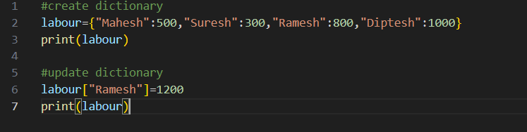
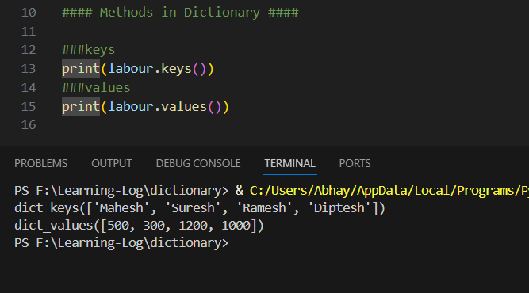
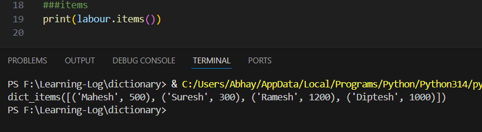
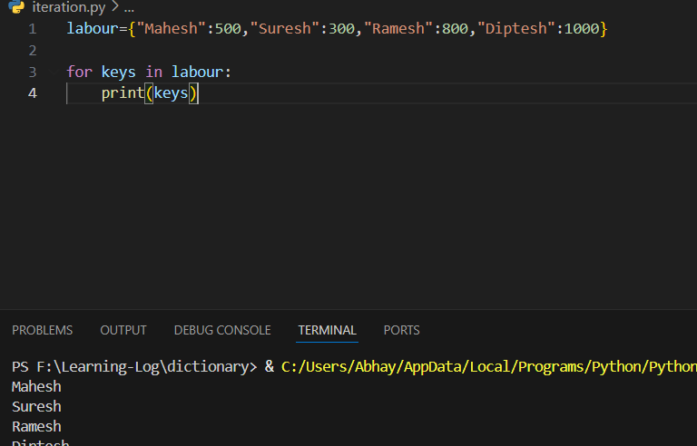
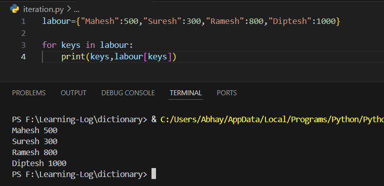
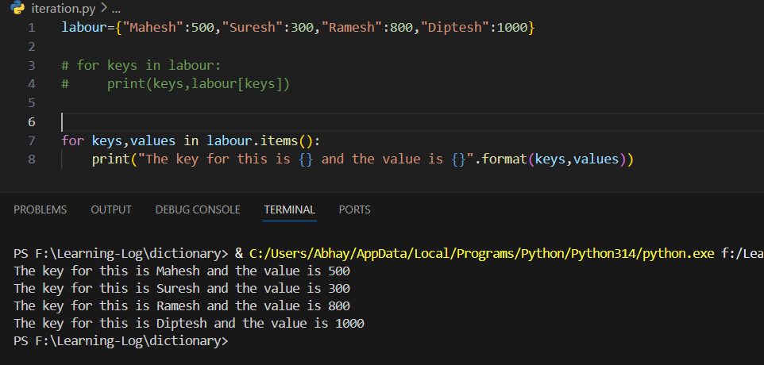

What is the use?
- NO SQL DB mostly have key value pair you mostly use dictionary
- JSON -> key value pair you can see dictionary format

## **Note : Key cannot be duplicate**

Create and update dictionary

####  **Methods in dictionary**
1.  **.keys**
2. **.values**

3. **.items** - returns a tuple of each key value pair

### Iteration

1. Print the keys

2. To get Values along with key
	

**Another way to access is via the tuple created using items( )**

