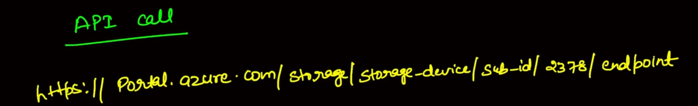
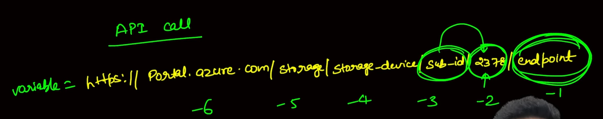
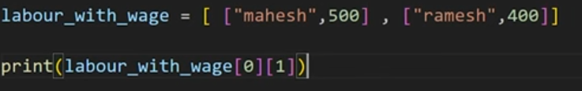
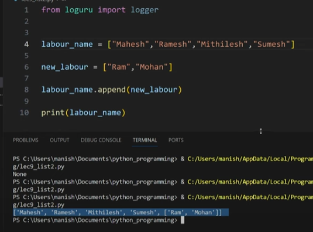
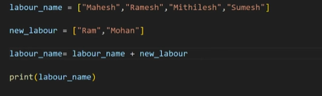
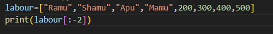
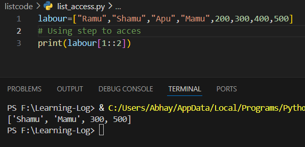

1. Empty List
```python
empty_list=[]
```
To this list we can append data


## Where is negative indexing used?

During API call



In such places where we have to access from the end  we use negative based indexing



## Method of list

1. append : to add element to the end of the list
2. extend: So we can add a new list to the list using extend
3. insert: to add element at  a particular index
		eg: list.insert(index,value)
4. pop : to delete element from end and returns the deleted element
```python
labour=["Ramu","Shamu","Apu","Mamu",200,300,400,500]

print(labour.pop())

o/p: 500
```
5. remove : removes first occurrence of the element
```python
labour=["Ramu","Shamu","Apu","Mamu",200,300,400,400,500]

print(labour.remove(400))

print(labour)

o/p:None
['Ramu', 'Shamu', 'Apu', 'Mamu', 200, 300, 400, 500]
```
6. del list_name: deletes the list
7. change list value
```python
labour=["Ram","Sham","Ap","Mam",200,300,400,400,500]

## so suppose you want to replace or change the name with each name having u at end

print(labour)

labour[0:4]=["Ramu","Shamu","Apu","Mamu"]

print(labour)


#############
output:
['Ram', 'Sham', 'Ap', 'Mam', 200, 300, 400, 400, 500]
['Ramu', 'Shamu', 'Apu', 'Mamu', 200, 300, 400, 400, 500]
```

7. Very imp
	1. split method:
		```python
		### split method

		hash_code="xyz-abc-123-obj"

		val=hash_code.split("-")

		print(val)
		
		output: ['xyz', 'abc', '123', 'obj']
		```
	
## Multi-dimensional List


### Features of List
1. It can have duplicate values
2. It is mutable in nature


Since we can see when we append one list inside other it comes as a list inside another list so we use **extend**

# Other way is to concatenate or Adding 2 list


## Using : to access a list



### Reverse a list
```python
labour=["Ramu","Shamu","Apu","Mamu",200,300,400,500]

print(labour[::-1])
```


