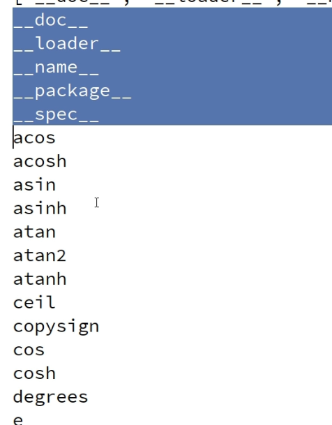

**~={yellow}import=~** keyword to bring modules the particular file
Some module name:
- math
- random
- time
- threadding

To see the members of a module use **dir** keyword
~={blue}syntax=~ : dir(module-name)

```python
import math  
print(dir(math))  
value=dir(math)  //retyrns a list of all the members
  
for val in value:  
    print(val)
```

Members with ''__" are  called pre-defined members and are also private and cannot be used by programmers

We can have alias for module name
```python
import math as m
```

## from
```python
from math import pi,pow
print(pi)
print(pow(a,b))
```
